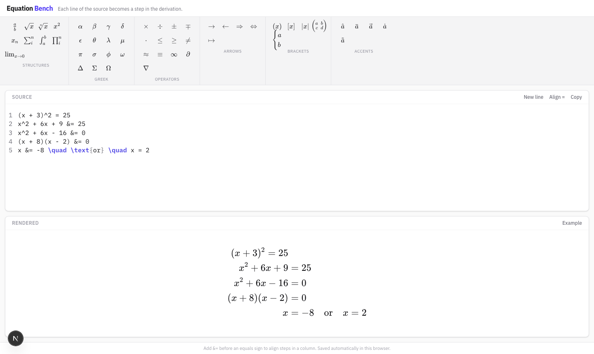

# Equation Bench

Editor de equações em LaTeX, com uma caixa de ferramentas (toolbar) para inserir símbolos com um clique, realce de sintaxe (syntax highlighting) e pré-visualização em tempo real. Corre no teu computador, no browser.



## O que esta ferramenta faz

- **Toolbar por categorias** — Estruturas, Grego, Operadores, Setas, Parênteses e Acentos. Clica num símbolo para o inserir na posição do cursor.
- **Pré-visualização em tempo real** — o que escreves em LaTeX é renderizado imediatamente como uma equação matemática.
- **Equações em várias linhas** — cada linha do editor é um passo de uma derivação (ex.: resolução de uma equação passo a passo). Escreve `&=` antes de um sinal de igual para alinhar todos os passos numa coluna.
- **Realce de sintaxe** — comandos LaTeX, chavetas e comentários aparecem em cores diferentes, tal como num editor de código.
- **Guarda automaticamente** — o que escreves fica guardado no browser. Se fechares e voltares a abrir a página, o conteúdo continua onde o deixaste.

## Antes de começar: o que precisas instalar

Esta ferramenta precisa do **Node.js** (versão 20 ou mais recente) para correr. O `npm` (gestor de pacotes) já vem incluído com o Node.js.

1. Vai a [nodejs.org](https://nodejs.org)
2. Descarrega e instala a versão **LTS** (a recomendada)
3. Para confirmar que ficou instalado, abre o terminal e escreve:
   ```
   node -v
   ```
   Deve aparecer um número de versão (ex.: `v20.x.x` ou superior).

## Instalação

1. Abre o terminal.
2. Entra na pasta do projeto:
   ```
   cd caminho/para/equation-bench
   ```
3. Instala as dependências (só precisas de fazer isto uma vez, ou sempre que o projeto for atualizado):
   ```
   npm install
   ```

## Como executar

1. No terminal, dentro da pasta do projeto, escreve:
   ```
   npm run dev
   ```
2. Abre o browser e vai a [http://localhost:3000](http://localhost:3000)
3. Para parar o programa, volta ao terminal e pressiona `Ctrl + C`.

Sempre que quiseres usar a ferramenta outra vez, basta repetir estes dois passos (`npm run dev` e abrir o link) — não precisas de instalar nada de novo, a não ser que o projeto tenha sido atualizado.

## Criar uma versão de produção (opcional)

Se quiseres uma versão mais rápida e otimizada (por exemplo, para deixar a correr de forma permanente):

```
npm run build
npm run start
```

A aplicação fica disponível no mesmo endereço: [http://localhost:3000](http://localhost:3000)

## Estrutura do projeto

```
equation-bench/
├── app/
│   ├── EquationBench.tsx   # A aplicação principal (toolbar, editor, pré-visualização)
│   ├── layout.tsx          # Estrutura da página (fontes, título)
│   ├── page.tsx            # Ponto de entrada da página
│   └── globals.css         # Estilos e cores
├── package.json            # Lista de dependências e comandos disponíveis
└── README.md                # Este ficheiro
```

## Problemas comuns

- **"comando não encontrado: npm"** — o Node.js não está instalado ou o terminal precisa de ser reaberto depois da instalação.
- **A porta 3000 já está em uso** — já tens outra aplicação a correr nessa porta. Fecha-a, ou corre `npm run dev -- -p 3001` para usar outra porta (nesse caso abre [http://localhost:3001](http://localhost:3001)).
- **As alterações que escrevi desapareceram** — o conteúdo é guardado por browser. Se abrires numa janela anónima/privada ou noutro browser, não vais ver o que escreveste antes.
