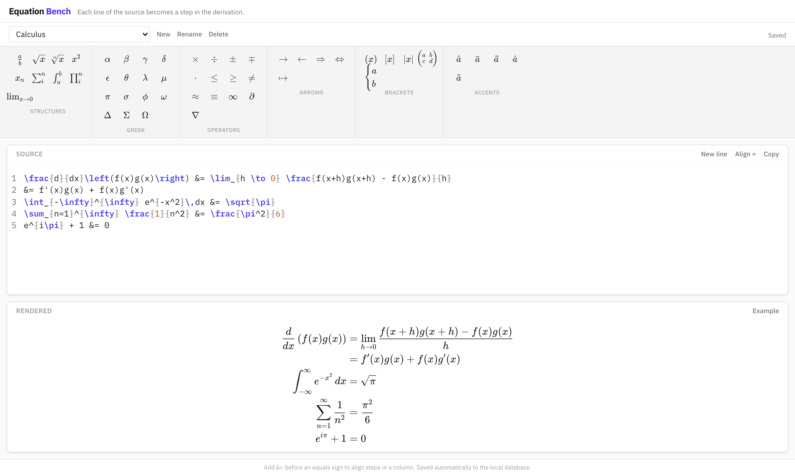
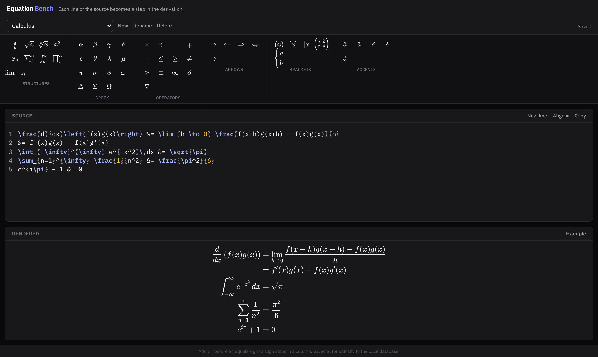
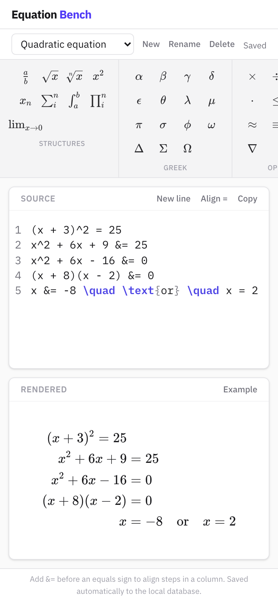

# Equation Bench

Editor de equações em LaTeX, com uma caixa de ferramentas (toolbar) para inserir símbolos com um clique, realce de sintaxe (syntax highlighting) e pré-visualização em tempo real. Corre no teu computador, no browser.


## Em imagens

**Cálculo passo a passo** — cada linha do editor é um passo; o `&=` alinha os sinais de igual.



**Modo escuro** — acompanha a preferência do teu sistema.



**No telemóvel** — o layout adapta-se a ecrãs pequenos.



## O que esta ferramenta faz

- **Toolbar por categorias** — Estruturas, Grego, Operadores, Setas, Parênteses e Acentos. Clica num símbolo para o inserir na posição do cursor.
- **Pré-visualização em tempo real** — o que escreves em LaTeX é renderizado imediatamente como uma equação matemática.
- **Equações em várias linhas** — cada linha do editor é um passo de uma derivação (ex.: resolução de uma equação passo a passo). Escreve `&=` antes de um sinal de igual para alinhar todos os passos numa coluna.
- **Realce de sintaxe** — comandos LaTeX, chavetas e comentários aparecem em cores diferentes, tal como num editor de código.
- **Vários documentos** — cria, muda de nome, troca entre e apaga documentos na barra por baixo do cabeçalho. Cada um é independente.
- **Guarda automaticamente** — cada alteração é gravada numa base de dados (SQLite) no teu computador, meio segundo depois de parares de escrever. O indicador no canto da barra mostra `Saved`, `Saving…`, `Unsaved changes` ou `Save failed`. Não há ficheiros para exportar nem importar: fecha a página, volta mais tarde e está tudo lá.

## Antes de começar: o que precisas instalar

Esta ferramenta precisa do **Node.js** (versão 20 ou mais recente) para correr. O `npm` (gestor de pacotes) já vem incluído com o Node.js.

> **Nota:** o Equation Bench tem um pequeno servidor local (feito com Next.js) que fala com a base de dados. Por isso **não** basta abrir um ficheiro no browser — tens de o executar com os comandos abaixo. Não precisas de instalar nem configurar a base de dados: o SQLite vem embutido e o ficheiro é criado sozinho.

1. Vai a [nodejs.org](https://nodejs.org)
2. Descarrega e instala a versão **LTS** (a recomendada)
3. Para confirmar que ficou instalado, abre o terminal e escreve:
   ```
   node -v
   ```
   Deve aparecer um número de versão (ex.: `v20.x.x` ou superior).

## Instalação

1. Abre o terminal.
2. Entra na pasta do projeto:
   ```
   cd caminho/para/equation-bench
   ```
3. Instala as dependências (só precisas de fazer isto uma vez, ou sempre que o projeto for atualizado):
   ```
   npm install
   ```
   Pode demorar um ou dois minutos. Os avisos amarelos (`warn`) são normais; só te deves preocupar se aparecer `ERR!` (ver "Problemas comuns").

## Como executar

1. No terminal, dentro da pasta do projeto, escreve:
   ```
   npm run dev
   ```
2. Abre o browser e vai a [http://localhost:3000](http://localhost:3000)
3. Para parar o programa, volta ao terminal e pressiona `Ctrl + C`.

Na primeira vez que abrires a página, é criado um documento chamado "My first document" e a pasta `data/` aparece dentro do projeto.

Sempre que quiseres usar a ferramenta outra vez, basta repetir estes dois passos (`npm run dev` e abrir o link) — não precisas de instalar nada de novo, a não ser que o projeto tenha sido atualizado.

## Criar uma versão de produção (opcional)

Se quiseres uma versão mais rápida e otimizada (por exemplo, para deixar a correr de forma permanente):

```
npm run build
npm run start
```

A aplicação fica disponível no mesmo endereço: [http://localhost:3000](http://localhost:3000)

A versão de produção precisa de um computador ou servidor com Node.js e **disco persistente** (a base de dados é um ficheiro). Não funciona em alojamentos "serverless" como a Vercel, onde o disco é apagado entre pedidos.

## Onde ficam os teus dados

Tudo fica num único ficheiro: `data/equation-bench.db` (mais `equation-bench.db-wal` e `equation-bench.db-shm`, que o SQLite usa enquanto a aplicação corre).

- **Cópia de segurança:** pára a aplicação (`Ctrl + C`) e copia a pasta `data/` inteira para um sítio seguro.
- **Restaurar:** com a aplicação parada, volta a colocar essa pasta dentro do projeto.
- **Começar do zero:** pára a aplicação e apaga a pasta `data/`.
- A pasta `data/` não é enviada para o Git (está no `.gitignore`).

## Como funciona (para quem quer perceber)

```
Editor (browser) ──escreves──▶ espera 0,5 s ──▶ PATCH /api/documents/<id> ──▶ SQLite (data/equation-bench.db)
```

- A API está em `app/api/documents/` e devolve JSON: `GET`/`POST /api/documents` (listar/criar) e `GET`/`PATCH`/`DELETE /api/documents/<id>` (ler/gravar/apagar um documento).
- O código da base de dados está em `lib/server/` e só corre no servidor.
- Não usa WebSockets: para uma pessoa a editar, um pedido por alteração chega. Só fariam falta para sincronizar vários separadores ou utilizadores em tempo real.
- O `localStorage` do browser guarda apenas qual era o último documento aberto.
## Estrutura do projeto

```
equation-bench/
├── app/
│   ├── layout.tsx, page.tsx, globals.css   # Estrutura da página, ponto de entrada, estilos e cores
│   ├── api/documents/                      # API REST (listar, criar, ler, gravar, apagar)
│   └── _components/equation-bench/         # A interface, uma subpasta por área:
│       ├── equation-bench.tsx              #   junta tudo
│       ├── toolbar/  editor/  preview/     #   caixa de ferramentas, editor, pré-visualização
│       ├── documents/                      #   lista de documentos e gravação automática
│       ├── latex/  layout/  ui/            #   KaTeX, cabeçalho/rodapé, peças reutilizáveis
├── lib/                                    # Código partilhado (tipos) e código de servidor (SQLite)
├── data/                                   # Base de dados (criada sozinha, fora do Git)
├── docs/                                   # Documentação para quem mexe no código
├── package.json                            # Dependências e comandos disponíveis
└── README.md                               # Este ficheiro
```

Quem vai alterar o código deve ler `docs/HITCHHIKERS_GUIDE.md` (regras de estilo e organização das pastas).

### Comandos úteis para quem desenvolve

| Comando | O que faz |
| --- | --- |
| `npm run dev` | Corre em modo de desenvolvimento (recarrega ao guardar ficheiros) |
| `npm run build` / `npm run start` | Cria e corre a versão de produção |
| `npm run lint` | Verifica o estilo do código |
| `npx tsc --noEmit` | Verifica os tipos TypeScript |

## Problemas comuns

- **"comando não encontrado: npm"** — o Node.js não está instalado ou o terminal precisa de ser reaberto depois da instalação.
- **A porta 3000 já está em uso** — já tens outra aplicação a correr nessa porta. Fecha-a, ou corre `npm run dev -- -p 3001` para usar outra porta (nesse caso abre [http://localhost:3001](http://localhost:3001)).
- **`npm install` falha com erros a mencionar `better-sqlite3`, `node-gyp` ou `python`** — o SQLite é um componente nativo. Confirma que usas a versão **LTS** do Node.js (versões muito recentes ou muito antigas podem não ter o componente pré-compilado). Se continuar a falhar, no macOS corre `xcode-select --install`; no Windows instala as "Build Tools" do Visual Studio (ou marca a opção de ferramentas nativas no instalador do Node.js).
- **Aparece "Could not reach the database." ou "Save failed"** — a aplicação deixou de estar a correr, ou a pasta `data/` não tem permissão de escrita. Confirma que o `npm run dev` continua ativo no terminal.
- **Não vejo os documentos que escrevi antes** — os documentos ficam em `data/equation-bench.db` no computador onde a aplicação corre. Se abriste o projeto noutra pasta ou noutro computador, a base de dados é outra. (Já não dependem do browser.)
- **Tinha texto guardado da versão antiga (só no browser)** — na primeira abertura é importado automaticamente para o documento "My first document".
- **Aviso de "Another next dev server is already running"** — já tens o programa aberto noutro terminal. Fecha-o (`Ctrl + C`) ou usa esse.
